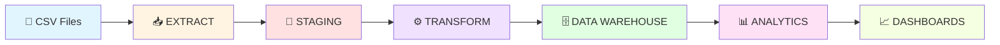
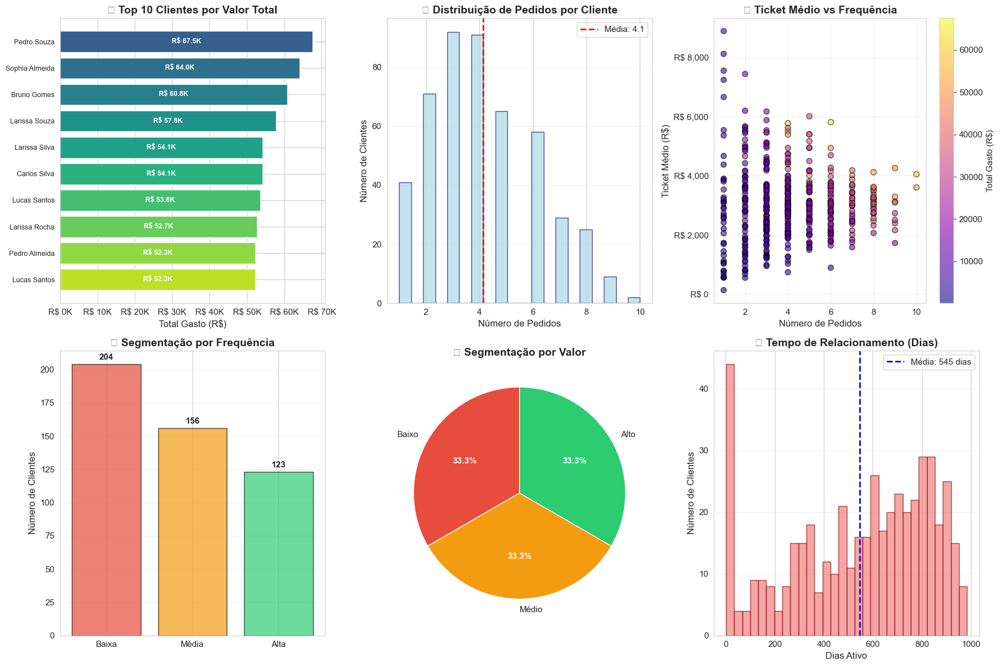
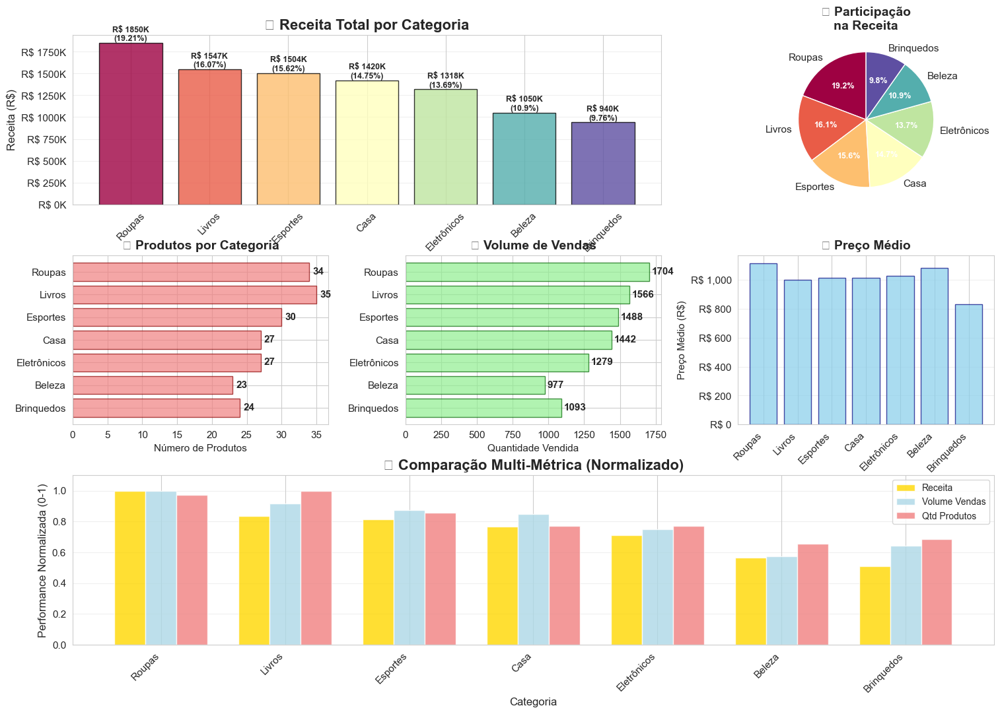

# 🛒 E-commerce ETL Analytics Pipeline


> **Pipeline completo de ETL e Analytics para E-commerce com Data Warehouse dimensional, análise de dados e dashboards interativos.**

---

## 📊 Métricas do Projeto

```
📦 Dados Processados:  6.383 registros        💰 Faturamento Total:  R$ 9.629.301,57
📈 Ticket Médio:       R$ 4.814,65             🛍️  Total de Pedidos:  2.000 pedidos
👥 Clientes Ativos:    483 clientes            📦 Produtos:           200 produtos
```

---

## 🎯 Visão Geral

Sistema de **Data Warehouse e Analytics** que transforma dados brutos de e-commerce em insights acionáveis através de um pipeline ETL automatizado.

### ✨ Características Principais

✅ **ETL Automatizado** → Extração, transformação e carga de dados  
✅ **Star Schema** → Modelagem dimensional otimizada para análise  
✅ **Data Quality** → Pipeline de limpeza e validação de dados  
✅ **Analytics Avançado** → KPIs, métricas e visualizações interativas  
✅ **Jupyter Notebooks** → Análises exploratórias e ad-hoc  
✅ **Dashboard Interativo** → Visualizações em tempo real com Streamlit  
✅ **Gráficos Estáticos** → Análises profissionais com Matplotlib/Seaborn  

---

## 🏗️ Arquitetura do Sistema

### Fluxo do Pipeline ETL



### Modelo Dimensional (Star Schema)

```
                    ┌─────────────┐
                    │ dim_cliente │
                    │    👥       │
                    │ cliente_id  │
                    │ nome        │
                    │ email       │
                    └──────┬──────┘
                           │
       ┌─────────────┐     │     ┌─────────────┐
       │ dim_produto │     │     │  dim_tempo  │
       │    📦       │     │     │     📅      │
       │ produto_id  │     │     │  tempo_id   │
       │ categoria   │     │     │  data       │
       │ preco       │     │     │  dia_semana │
       └──────┬──────┘     │     └──────┬──────┘
              │            │            │
              │       ┌────┴────┐       │
              └───────┤  FATO   ├───────┘
                      │ VENDAS  │
                      │   💰    │
                      │ venda_id│
                      │quantidade│
                      │valor_total│
                      └─────────┘
```

---

## 🔄 Pipeline ETL - Passo a Passo

### 1️⃣ **EXTRACT** - Extração de Dados

```python
# Leitura de múltiplos arquivos CSV
import pandas as pd

df_clientes = pd.read_csv('data/raw/clientes.csv')
df_produtos = pd.read_csv('data/raw/produtos.csv')
df_pedidos = pd.read_csv('data/raw/pedidos.csv')
df_itens = pd.read_csv('data/raw/item_pedido.csv')
```

### 2️⃣ **TRANSFORM** - Limpeza e Transformação

```python
# Pipeline de Data Quality
def limpar_dados(df):
    """Remove duplicatas e trata valores ausentes"""
    # Remover duplicatas
    df = df.drop_duplicates()
    
    # Validar dados obrigatórios
    df = df.dropna(subset=['campo_obrigatorio'])
    
    # Converter tipos de dados
    df['data'] = pd.to_datetime(df['data'])
    df['valor'] = pd.to_numeric(df['valor'], errors='coerce')
    
    # Calcular métricas
    df['valor_total'] = df['quantidade'] * df['preco_unitario']
    
    return df

# Agregação inteligente (evita duplicatas)
query = """
SELECT dt.dia_semana,
       COUNT(DISTINCT f.pedido_id) AS num_pedidos,
       SUM(f.valor_total) AS faturamento
FROM fato_vendas f
JOIN dim_tempo dt ON f.tempo_id = dt.tempo_id
GROUP BY dt.dia_semana
"""
```

### 3️⃣ **LOAD** - Carga no Data Warehouse

```python
import sqlite3

conn = sqlite3.connect('ecommerce_sqlite.db')

# Criar dimensões
dim_cliente.to_sql('dim_cliente', conn, if_exists='replace', index=False)
dim_produto.to_sql('dim_produto', conn, if_exists='replace', index=False)
dim_tempo.to_sql('dim_tempo', conn, if_exists='replace', index=False)

# Criar tabela fato
fato_vendas.to_sql('fato_vendas', conn, if_exists='replace', index=False)
```

### 4️⃣ **ANALYZE** - Análise e KPIs

```sql
-- Faturamento Mensal com Tendência
SELECT 
    strftime('%Y-%m', dt.data) AS mes,
    SUM(f.valor_total) AS faturamento,
    COUNT(DISTINCT f.pedido_id) AS num_pedidos,
    ROUND(AVG(f.valor_total), 2) AS ticket_medio
FROM fato_vendas f
JOIN dim_tempo dt ON f.tempo_id = dt.tempo_id
GROUP BY mes
ORDER BY mes;
```

---

## 🚀 Início Rápido

### Instalação

```bash
# 1. Clonar repositório
git clone https://github.com/ru-fagundes/Ecommerce_ETL_Analytics_Pipeline.git
cd Ecommerce_ETL_Analytics_Pipeline

# 2. Criar ambiente virtual
python -m venv venv
venv\Scripts\activate  # Windows

# 3. Instalar dependências
pip install -r config/requirements.txt
```

### Execução

```bash
# 1. Executar pipeline ETL completo
python scripts/pipeline_carga.py

# Saída esperada:
# [2025-12-07 10:30:15] ✅ Conectado ao database
# [2025-12-07 10:30:16] 📥 Carregando staging...
# [2025-12-07 10:30:25] ✅ Pipeline concluído com sucesso!

# 2. Gerar análises e KPIs
python scripts/analise_dados.py

# Saída esperada:
# 📊 KPIs PRINCIPAIS:
# 💰 Faturamento Total: R$ 9.629.301,57
# 📈 Ticket Médio: R$ 4.814,65

# 3. Abrir notebook de análises
jupyter notebook notebooks/notebook_etl_analysis.ipynb

# 4. (Opcional) Extrair imagens das visualizações
python scripts/capturar_graficos.py
```

### 📓 Como Usar o Notebook

**Opção 1 - Execução Completa (Recomendado):**
```bash
# 1. Abrir notebook
jupyter notebook notebooks/notebook_etl_analysis.ipynb

# 2. No Jupyter, selecionar: Menu → Kernel → Restart & Run All
# ✅ Todas as 36 células serão executadas em sequência
# ⏱️ Tempo estimado: 2-3 minutos
```

**Opção 2 - Execução Seletiva:**
```python
# Execute células específicas:
# - Células 1-10: Setup e conexão
# - Células 11-17: KPIs básicos (OBRIGATÓRIO antes das avançadas)
# - Células 18-22: Limpeza de dados (OBRIGATÓRIO)
# - Células 23-34: Análises avançadas (pode executar individualmente)
```

**Opção 3 - Apenas Visualizar Resultados:**
```bash
# Se o notebook já foi executado anteriormente:
# 1. Abra o arquivo .ipynb no VS Code ou Jupyter
# 2. Role até as células com gráficos (11, 14, 17, 24, 26, 28, 30, 32, 34)
# 3. Visualize os outputs salvos
```

---

## 🌐 Dashboard Interativo (Streamlit)

### 🚀 Como Abrir o Dashboard no Navegador

**Pré-requisitos:**
```bash
# 1. Certifique-se que o pipeline ETL foi executado
python scripts/criar_tabelas_analiticas.py  # Criar estrutura
python scripts/pipeline_carga.py            # Popular dados

# Saída esperada:
# ✅ dim_tempo: 880 registros
# ✅ dim_cliente: 500 registros
# ✅ dim_produto: 200 registros
# ✅ fato_vendas: 3.183 registros
```

**Iniciar Dashboard:**
```bash
# Executar aplicação Streamlit
streamlit run dashboard/app.py

# Saída no terminal:
#   You can now view your Streamlit app in your browser.
#
#   Local URL: http://localhost:8501
#   Network URL: http://192.168.x.x:8501
```

**Acessar no Navegador:**

1. **Opção 1 - Automático**: O navegador abre automaticamente
2. **Opção 2 - Manual**: Acesse `http://localhost:8501`
3. **Opção 3 - Rede Local**: Use o Network URL para acessar de outros dispositivos

**Para Parar o Dashboard:**
```bash
# No terminal onde o Streamlit está rodando:
# Pressione Ctrl + C
```

### 📊 Recursos do Dashboard Interativo

**Filtros Dinâmicos:**
- 📅 **Período**: Selecione intervalo de datas personalizado
- 📦 **Categoria**: Filtre por categoria de produto
- 🔄 **Atualização em Tempo Real**: Dados atualizados a cada interação

**Visualizações Disponíveis:**

🎯 **Página Principal - Visão Geral:**
- KPIs principais (Cards com métricas-chave)
- Gráfico de linha: Evolução temporal do faturamento
- Gráfico de pizza: Participação por categoria
- Gráfico de barras: Top produtos

📈 **Análises Avançadas:**
- Heatmap de vendas por dia da semana
- Análise de comportamento de clientes
- Distribuições estatísticas interativas
- Análise de outliers com filtros

💡 **Recursos Interativos:**
- **Hover**: Passe o mouse sobre gráficos para ver detalhes
- **Zoom**: Clique e arraste para ampliar áreas específicas
- **Download**: Exporte gráficos em PNG (botão no canto superior direito)
- **Filtros**: Sidebar com controles de data e categoria

### 🛠️ Tecnologias Utilizadas no Dashboard

```python
import streamlit as st        # Framework web interativo
import plotly.express as px   # Gráficos interativos
import plotly.graph_objects   # Gráficos customizados
import pandas as pd           # Manipulação de dados
import sqlite3                # Conexão com banco de dados
```

**Vantagens do Streamlit:**
- ✅ Zero configuração de frontend
- ✅ Gráficos interativos nativos (Plotly)
- ✅ Atualização automática ao modificar código
- ✅ Deploy fácil (Streamlit Cloud, Heroku, etc.)
- ✅ Widgets prontos (sliders, select boxes, date pickers)

### 🎨 Customizações do Dashboard

**Configuração da Página:**
```python
st.set_page_config(
    page_title="E-commerce Analytics Dashboard",
    page_icon="🛒",
    layout="wide",
    initial_sidebar_state="expanded"
)
```

**CSS Customizado:**
- Tema escuro/claro adaptativo
- Cards com gradientes
- Animações suaves
- Responsivo para mobile/tablet

### 📱 Acesso Remoto (Rede Local)

**Compartilhar Dashboard na Rede Local:**

1. Execute o dashboard normalmente
2. Copie o **Network URL** do terminal (exemplo: `http://192.168.15.8:8501`)
3. Compartilhe este URL com outros dispositivos na mesma rede Wi-Fi
4. Acesse de tablets, smartphones ou outros computadores

**Exemplo de Uso:**
```bash
# No computador principal:
streamlit run dashboard/app.py

# Saída:
#   Network URL: http://192.168.15.8:8501

# Em outro dispositivo (mesma rede):
# Abra o navegador e acesse: http://192.168.15.8:8501
```

---

## 📊 Visualizações e Dashboards

> ⚠️ **Para visualizar os gráficos no README**:
> 
> 1. Abra o notebook: `notebooks/notebook_etl_analysis.ipynb`
> 2. Execute **todas as células** (Menu → Run → Run All Cells)
> 3. Os gráficos serão exibidos automaticamente no notebook
> 4. **Para extrair imagens PNG**: Execute `python scripts/capturar_graficos.py`
>
> **Nota**: O script `capturar_graficos.py` extrai as imagens diretamente do notebook JSON (não precisa executar células primeiro se já foram executadas anteriormente)

### Dashboard Executivo



**KPIs Principais:**
- 💰 Faturamento Total
- 📈 Ticket Médio  
- 🛍️ Total de Pedidos
- 👥 Clientes Únicos

**Gráficos:**
- Evolução do Faturamento Mensal
- Participação de Receita por Categoria (Pizza)
- Top 5 Produtos Mais Vendidos
- Distribuição de Pedidos por Faixa de Valor

---

### Distribuições Estatísticas e Análise de Outliers



**Dashboard com 6 Análises Estatísticas:**
- **Histograma de Valor dos Pedidos** (com média e mediana)
- **Boxplot de Valor dos Pedidos** (detecção de outliers, Q1, Q3, IQR)
- **Distribuição de Itens por Pedido** (histograma com média)
- **Scatter: Valor vs Quantidade** (relação entre itens e valor total)
- **Violin Plot por Quartil de Itens** (distribuição em cada quartil)
- **Identificação de Outliers** (scatter com limite superior marcado)

**Estatísticas Fornecidas:**
- Desvio padrão e coeficiente de variação
- Análise de outliers (1.5 * IQR)
- Top 5 maiores outliers identificados

**Nota**: Esta visualização é gerada pela **célula 32** do notebook

---


## 💻 Exemplos de Queries SQL

### Top 10 Produtos Mais Vendidos

```sql
SELECT 
    p.nome AS produto,
    p.categoria,
    SUM(f.quantidade) AS total_vendido,
    SUM(f.valor_total) AS receita_total,
    ROUND(AVG(f.valor_unitario), 2) AS preco_medio
FROM fato_vendas f
JOIN dim_produto p ON f.produto_id = p.produto_id
GROUP BY p.produto_id, p.nome, p.categoria
ORDER BY total_vendido DESC
LIMIT 10;
```

**Resultado:**
```
produto              | categoria    | total_vendido | receita_total | preco_medio
---------------------|--------------|---------------|---------------|-------------
Produto 163 - Plus   | Eletrônicos  | 90            | R$ 450.000    | R$ 5.000
Produto 32 - Plus    | Casa         | 85            | R$ 425.000    | R$ 5.000
Produto 173 - Plus   | Beleza       | 82            | R$ 410.000    | R$ 5.000
```

---

### Análise de Faturamento por Categoria

```sql
SELECT 
    p.categoria,
    COUNT(DISTINCT p.produto_id) AS num_produtos,
    SUM(f.valor_total) AS receita,
    ROUND(SUM(f.valor_total) * 100.0 / 
          (SELECT SUM(valor_total) FROM fato_vendas), 2) AS percentual
FROM fato_vendas f
JOIN dim_produto p ON f.produto_id = p.produto_id
GROUP BY p.categoria
ORDER BY receita DESC;
```

---

### Tendência de Vendas por Dia da Semana

```sql
SELECT 
    CASE dt.dia_semana
        WHEN 0 THEN 'Domingo'
        WHEN 1 THEN 'Segunda'
        WHEN 2 THEN 'Terça'
        WHEN 3 THEN 'Quarta'
        WHEN 4 THEN 'Quinta'
        WHEN 5 THEN 'Sexta'
        WHEN 6 THEN 'Sábado'
    END AS dia,
    COUNT(DISTINCT f.pedido_id) AS num_pedidos,
    SUM(f.valor_total) AS faturamento,
    ROUND(AVG(f.valor_total), 2) AS ticket_medio
FROM fato_vendas f
JOIN dim_tempo dt ON f.tempo_id = dt.tempo_id
GROUP BY dt.dia_semana
ORDER BY dt.dia_semana;
```

---

## 🔍 Funcionalidades de Data Quality

### Pipeline de Limpeza Automático

```python
def verificar_qualidade_dados(conn):
    """
    Análise exploratória automática
    Detecta problemas de qualidade nos dados
    """
    problemas = []
    
    # 1. Verificar estrutura das tabelas
    for tabela in ['dim_cliente', 'dim_produto', 'dim_tempo', 'fato_vendas']:
        query = f"PRAGMA table_info({tabela})"
        schema = pd.read_sql(query, conn)
        print(f"✅ Estrutura {tabela}: {len(schema)} colunas")
    
    # 2. Detectar duplicatas
    query = """
    SELECT data, dia_semana, COUNT(*) as qtd
    FROM dim_tempo
    GROUP BY data, dia_semana
    HAVING COUNT(*) > 1
    """
    duplicatas = pd.read_sql(query, conn)
    if len(duplicatas) > 0:
        problemas.append(f"⚠️ {len(duplicatas)} duplicatas em dim_tempo")
    
    # 3. Identificar valores nulos
    query = "SELECT COUNT(*) FROM fato_vendas WHERE valor_total IS NULL"
    nulls = pd.read_sql(query, conn).iloc[0, 0]
    if nulls > 0:
        problemas.append(f"⚠️ {nulls} valores nulos em fato_vendas")
    
    return problemas
```

### Bins Dinâmicos para Distribuições

```python
import numpy as np

def criar_bins_dinamicos(df, coluna):
    """Cria bins adaptativos baseados no valor máximo"""
    max_valor = df[coluna].max()
    
    if max_valor <= 5000:
        bins = [0, 1000, 2000, 3000, 4000, np.inf]
        labels = ['0-1K', '1K-2K', '2K-3K', '3K-4K', '4K+']
    elif max_valor <= 10000:
        bins = [0, 2000, 4000, 6000, 8000, np.inf]
        labels = ['0-2K', '2K-4K', '4K-6K', '6K-8K', '8K+']
    else:
        bins = [0, 10000, 20000, 50000, np.inf]
        labels = ['0-10K', '10K-20K', '20K-50K', '50K+']
    
    return bins, labels

# Uso
bins, labels = criar_bins_dinamicos(df_vendas, 'valor_pedido')
df_vendas['faixa'] = pd.cut(df_vendas['valor_pedido'], bins=bins, labels=labels)
```

---

## 📁 Estrutura do Projeto

```
ecommerce-etl-pipeline/
│
├── 📂 config/
│   └── requirements.txt          # Dependências Python
│
├── 📂 data/
│   ├── raw/                      # CSVs originais
│   │   ├── clientes.csv
│   │   ├── produtos.csv
│   │   ├── pedidos.csv
│   │   └── item_pedido.csv
│   └── processed/                # Dados processados
│
├── 📂 dashboard/
│   └── app.py                    # Aplicação Streamlit
│
├── 📂 docs/
│   ├── RELATORIO_FINAL.md        # Relatório técnico completo
│   ├── GUIA_SCREENSHOTS.md       # Guia de captura de imagens
│   ├── ATUALIZACOES_DEZ2025.md   # Changelog de melhorias
│   └── screenshots/              # Imagens das visualizações
│
├── 📂 notebooks/
│   └── notebook_etl_analysis.ipynb  # Análises interativas (36 células)
│
├── 📂 scripts/
│   ├── pipeline_carga.py         # Pipeline ETL principal
│   ├── sqlite_etl.py             # ETL específico SQLite
│   ├── analise_dados.py          # Geração de KPIs e relatórios
│   └── verificar_database.py     # Diagnóstico e validação
│
├── 📂 sql/
│   ├── ddl/
│   │   ├── ddl_transacional.sql  # Schema fonte
│   │   └── ddl_analitico.sql     # Schema DW
│   └── queries/
│       ├── analytical_queries.sql # Queries de análise
│       └── quality_checks.sql     # Validações de qualidade
│
├── 🗄️ ecommerce_sqlite.db        # Database SQLite (9 tabelas)
└── 📄 README.md                   # Este arquivo
```

---

## 🛠️ Tecnologias Utilizadas

| Categoria | Tecnologias |
|-----------|-------------|
| **Linguagem** | Python 3.8+ |
| **Database** | SQLite 3 |
| **ETL & Data** | Pandas, NumPy |
| **Visualização** | Matplotlib, Seaborn, Plotly |
| **Dashboard Interativo** | Streamlit 1.28+ |
| **Notebooks** | Jupyter Notebook |
| **Controle de Versão** | Git, GitHub |

---

### Comandos Úteis

```bash
# Verificar instalação do Streamlit
streamlit --version

# Limpar cache do Streamlit
streamlit cache clear

# Ver configurações do Streamlit
streamlit config show

# Executar em modo de debug
streamlit run dashboard/app.py --logger.level=debug

# Desabilitar monitoramento de arquivos (mais rápido)
streamlit run dashboard/app.py --server.fileWatcherType none
```

---

## 📚 Documentação Completa

### Guias Disponíveis

- 📘 [**RELATORIO_FINAL.md**](docs/RELATORIO_FINAL.md) - Relatório técnico completo com todas as melhorias implementadas
- 📸 [**GUIA_SCREENSHOTS.md**](docs/GUIA_SCREENSHOTS.md) - Tutorial para captura de visualizações
- 🆕 [**ATUALIZACOES_DEZ2025.md**](docs/ATUALIZACOES_DEZ2025.md) - Changelog de melhorias v2.1
- 📊 [**INDICE_DOCUMENTACAO.md**](docs/INDICE_DOCUMENTACAO.md) - Índice completo da documentação

---

## 🎯 Casos de Uso

### 1. Análise de Vendas
- Identificar produtos mais vendidos
- Analisar tendências temporais
- Calcular métricas de performance

### 2. Segmentação de Clientes
- Top clientes por faturamento
- Análise de frequência de compra
- Ticket médio por cliente

### 3. Otimização de Estoque
- Produtos com baixa rotatividade
- Sazonalidade de vendas
- Previsão de demanda

### 4. Business Intelligence
- Dashboards executivos
- Relatórios automatizados
- Alertas de performance

---

## 🚀 Melhorias Futuras

- [✓] **Dashboard Streamlit interativo** ✅ **IMPLEMENTADO**
- [ ] API REST para consultas
- [ ] Integração com Power BI
- [ ] Machine Learning para previsões
- [ ] Pipeline em tempo real (Kafka/Airflow)
- [ ] Testes automatizados (pytest)
- [ ] CI/CD com GitHub Actions
- [ ] Containerização (Docker)

---

## 📧 Contato

**Rubia Fagundes**  
📧 Email: [rubiafagundes_ds@outlook.com](mailto:seu-email@example.com)  
💼 LinkedIn: [linkedin.com/in/rubiafagundes](https://linkedin.com/in/seu-perfil)  
🐱 GitHub: [@ru-fagundes](https://github.com/ru-fagundes)

---

## 📄 Licença

Este projeto está sob a licença MIT. Veja o arquivo [LICENSE](LICENSE) para mais detalhes.

---

## ⭐ Agradecimentos

Projeto desenvolvido como portfólio de **Engenharia de Dados** demonstrando habilidades em:
- Pipeline ETL
- Modelagem Dimensional
- Data Quality
- Analytics com SQL
- Visualização de Dados
- Dashboards Interativos (Streamlit)
- Python para Dados

---

<div align="center">

**⭐ Se este projeto foi útil, considere dar uma estrela no repositório!**

[](https://github.com/ru-fagundes/Ecommerce_ETL_Analytics_Pipeline/stargazers)
[](https://github.com/ru-fagundes/Ecommerce_ETL_Analytics_Pipeline/network/members)

</div>

---

*Última atualização: 09/12/2025 - v2.2 - Dashboard Interativo Streamlit*
